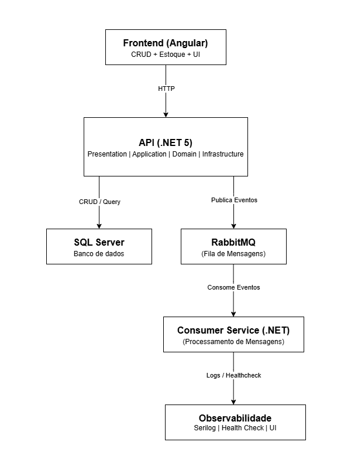
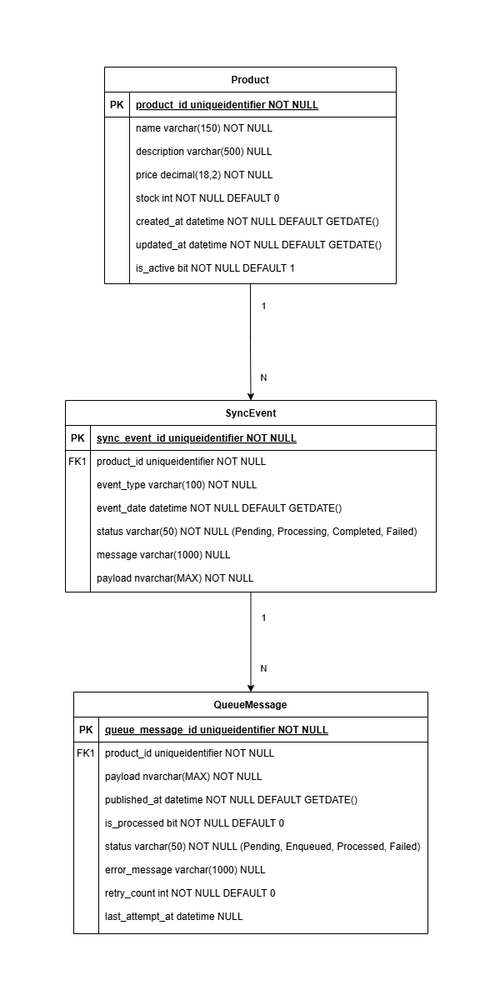

# PulseHub – Plataforma de Sincronização de Estoques Multicanal

🚀 **Arquitetura Escalável • Clean Architecture • Domain-Driven Design (DDD)**

---

## 🧠 Visão Geral

O **PulseHub** é uma plataforma backend projetada para resolver, de forma robusta e escalável, o desafio de **sincronização de cadastros, produtos e estoques entre múltiplos marketplaces e canais de venda.**

Ele simula um ambiente real de integração multicanal, aplicando os mais modernos conceitos de arquitetura de software, mensageria assíncrona e design orientado ao domínio (**DDD, Clean Architecture e SOLID**).

---

## 🎯 Funcionalidades

- 🛍️ **Gestão de produtos**: cadastro, atualização, soft delete e controle de estoque.
- 🔄 **Sincronização multicanal**: qualquer alteração gera um evento que é publicado nas filas configuradas.
- 📤 **Mensageria resiliente via RabbitMQ** com controle de tentativas, erros e múltiplos canais (Mercado Livre, Shopee, etc.).
- 📊 **Painel administrativo (Angular)**: gerenciamento dos produtos, estoque e monitoramento dos eventos.
- 🚥 **Monitoramento inteligente** dos eventos, tentativas e falhas, com dashboards de acompanhamento.
- 🛠️ **Health checks, logs estruturados (Serilog)** e tratamento global de exceções.
- 🔗 API RESTful bem documentada com **Swagger/OpenAPI** e respostas padronizadas.
- 🧠 **Camada de consumidores desacoplada** com retry inteligente e suporte a dead-letter.
- ♻️ **Arquitetura preparada para escala horizontal e fácil manutenção.**

---

## 🏗️ Estrutura do Projeto

```
pulsehub/
├── PulseHub.API                 → Camada de apresentação (Controllers, Middlewares)
├── PulseHub.Application         → Camada de aplicação (DTOs, Services, Mappings)
├── PulseHub.Domain              → Camada de domínio (Entidades, Interfaces, Enums)
├── PulseHub.Infrastructure      → Acesso a dados, Migrations, Mensageria, UnitOfWork
├── PulseHub.Application.Tests   → Testes unitários
├── PulseHub.Infrastructure.Tests→ Testes de integração
├── PulseHub.Consumer            → Serviço Worker (Consumer RabbitMQ)
└── PulseHub.sln                 → Arquivo da solução
```

---

## 🔀 Mapeamento de Dados

- ✔️ **AutoMapper:** Mapeamento automático de entidades para DTOs (Responses).
- ✔️ **Mapeamento manual:** Aplicado em DTOs de entrada (Requests) e cenários com regras específicas.

---

## 📦 Mensageria Resiliente com RabbitMQ

- Toda alteração em produtos gera um **SyncEvent** que é persistido e publicado nas filas configuradas.
- ✔️ **Múltiplos canais:** Mercado Livre, Shopee e outros (configurável via `appsettings.json`).
- ✔️ **Controle avançado:** Tentativas (`RetryCount`), último erro (`ErrorMessage`), e data da última tentativa (`LastAttemptAt`).
- ✔️ **IsProcessed:** Marca a mensagem como concluída apenas após confirmação real do processamento.
- ✔️ **Alta disponibilidade:** Mesmo com RabbitMQ offline, os eventos ficam registrados para reprocessamento posterior.

---

### 🔧 Configuração da Fila (Exemplo)

- **Canais:** MercadoLivre, Shopee
- **Durabilidade:** ✔️ Persistente
- **Painel RabbitMQ:**  
`http://localhost:15672`  
→ **Usuário:** guest | **Senha:** guest

---

## 🌐 Como Executar o Projeto

### ✔️ Pré-requisitos

- .NET 5 SDK
- SQL Server (local ou nuvem)
- RabbitMQ (local ou Docker)

### ✔️ Instalar dependências

```bash
dotnet restore
```

### ✔️ Aplicar as Migrations

```bash
cd PulseHub.Infrastructure
dotnet ef database update --startup-project ../PulseHub.API
```

### ✔️ Executar a API

```bash
cd PulseHub.API
dotnet run
```

- Acesse:  
`https://localhost:{porta}/swagger`

### ✔️ Executar o Worker (Consumer)

```bash
cd PulseHub.Consumer
dotnet run
```

---

## 🧪 Executando os Testes

### ✔️ Testes de Integração

```bash
cd PulseHub.Infrastructure.Tests
dotnet test
```

### ✔️ Testes Unitários

```bash
cd PulseHub.Application.Tests
dotnet test
```

---

## 🧠 Diagrama de Arquitetura



---

## 🗃️ Modelagem das Entidades



---

## 🚀 Tecnologias e Ferramentas

- ✔️ .NET 5 + ASP.NET Web API
- ✔️ Entity Framework Core + SQL Server
- ✔️ RabbitMQ (Mensageria assíncrona)
- ✔️ AutoMapper, xUnit, FluentAssertions, Moq
- ✔️ Swagger (OpenAPI)
- ✔️ Serilog (Logs estruturados)

---

## 🚦 Observabilidade

- ✔️ **Health Checks** (API e Consumers)
- ✔️ Logs estruturados e rastreáveis
- ✔️ Dashboards planejados para monitoramento das filas e eventos

---

## 🏪 Marketplace Ready

- 🔗 Arquitetura pronta para integração real com marketplaces como Mercado Livre e Shopee.
- ✔️ O sistema permite adicionar novos canais de forma simples, bastando configurá-los no `appsettings.json`.

---

## 💡 Considerações Finais

O **PulseHub** foi desenvolvido para representar com fidelidade os desafios de um backend robusto, resiliente e escalável, com ênfase em mensageria, arquitetura limpa, desacoplamento e integração multicanal.
