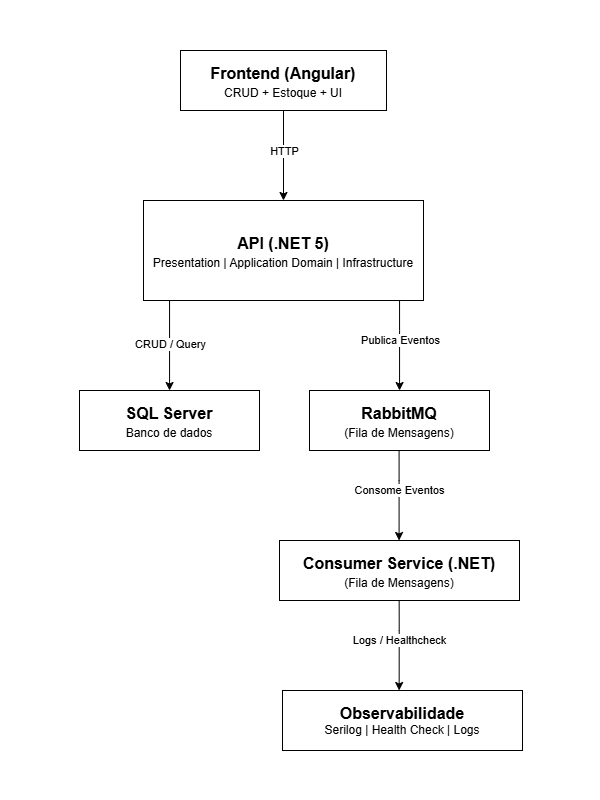
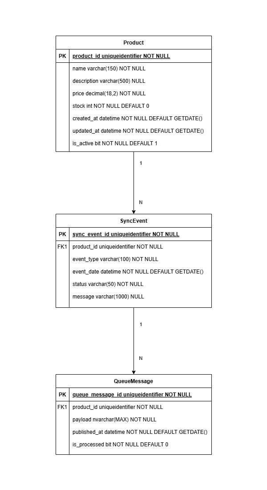

# PulseHub – Plataforma de Sincronização de Estoques Multicanal

🚀 Estrutura  – Clean Architecture + DDD

---

## 🧠 Visão Geral

O PulseHub é uma plataforma backend desenvolvida com o objetivo de simular e resolver o desafio real de sincronização de cadastros, produtos e estoques entre múltiplos canais de venda e marketplaces.

Este projeto foi idealizado para demonstrar domínio técnico nas principais tecnologias do mercado, além da capacidade de entregar soluções escaláveis, robustas e bem arquitetadas, utilizando práticas modernas como Clean Architecture, SOLID e Domain-Driven Design (DDD).

---

## 🎯 O que este projeto demonstra

- ✔️ Backend robusto com **.NET 5 / C#**
- ✔️ Banco de dados relacional com **SQL Server**, modelado e otimizado
- ✔️ Mensageria assíncrona via **RabbitMQ** (simulando AWS SQS)
- ✔️ API RESTful limpa, bem estruturada e documentada com **Swagger**
- ✔️ Frontend com **Angular + Angular Material** (painel administrativo)
- ✔️ Arquitetura modular com **Clean Architecture + SOLID + DDD**
- ✔️ Observabilidade: logs estruturados (**Serilog**), health checks e monitoramento
- ✔️ Desacoplamento total entre camadas, seguindo práticas de microserviços
- ✔️ Padrões de design aplicados: **Repository, Unit of Work, Mediator, Factory, Strategy**
- ✔️ GitFlow aplicado no versionamento

---

## 🚀 Funcionalidades do MVP

- 🛍️ Cadastro de produtos: nome, descrição, preço e estoque
- 📦 Controle de estoque: ajuste de quantidades e visualização do saldo
- 🔄 Sincronização automática: cada alteração gera eventos simulando integração com marketplaces
- 🔗 API RESTful: pronta para consumo externo
- 📤 Fila de mensagens: atualizações processadas de forma assíncrona via RabbitMQ
- 🔍 Monitoramento: health checks, logs estruturados e feedback visual via frontend
- 🖥️ Painel administrativo (Angular): CRUD de produtos, gestão de estoque e visualização dos eventos de sincronização

---

## 📂 Estrutura do Projeto

```
/PulseHub
	├── PulseHub.API → Camada de apresentação (Controllers, Startup, Program)
	├── PulseHub.Application → Camada de aplicação (Services, DTOs, Interfaces)
	├── PulseHub.Domain → Camada de domínio (Entities, Aggregates, Interfaces dos Repositórios)
	├── PulseHub.Infrastructure → Camada de infraestrutura (EF Core, Repositórios, Acesso a Dados)
	├── docs → Diagramas de Arquitetura e Modelagem de Entidades
	└── PulseHub.sln → Arquivo da solução
```

---
---

## 🏗️ Diagrama de Arquitetura



---

## 🗃️ Modelagem das Entidades



---

## 🛠️ Tecnologias e Ferramentas

- **Backend:** .NET 5, ASP.NET Web API, Entity Framework, MediatR, Serilog
- **Banco de Dados:** SQL Server
- **Mensageria:** RabbitMQ (simulando AWS SQS)
- **Frontend:** Angular + Angular Material + RxJS
- **Versionamento:** Git + GitFlow
- **Documentação:** Swagger (OpenAPI)
- **Testes:** NUnit + Moq

---

## 🚧 Observações

- Este repositório está em desenvolvimento ativo.
- O PulseHub foi desenvolvido para demonstrar domínio em arquitetura de software, backend em .NET, mensageria, APIs RESTful e integração com frontend Angular.
- Projeto idealizado para resolver desafios de integração, sincronização de cadastros, produtos e estoques entre múltiplos canais de venda e marketplaces.